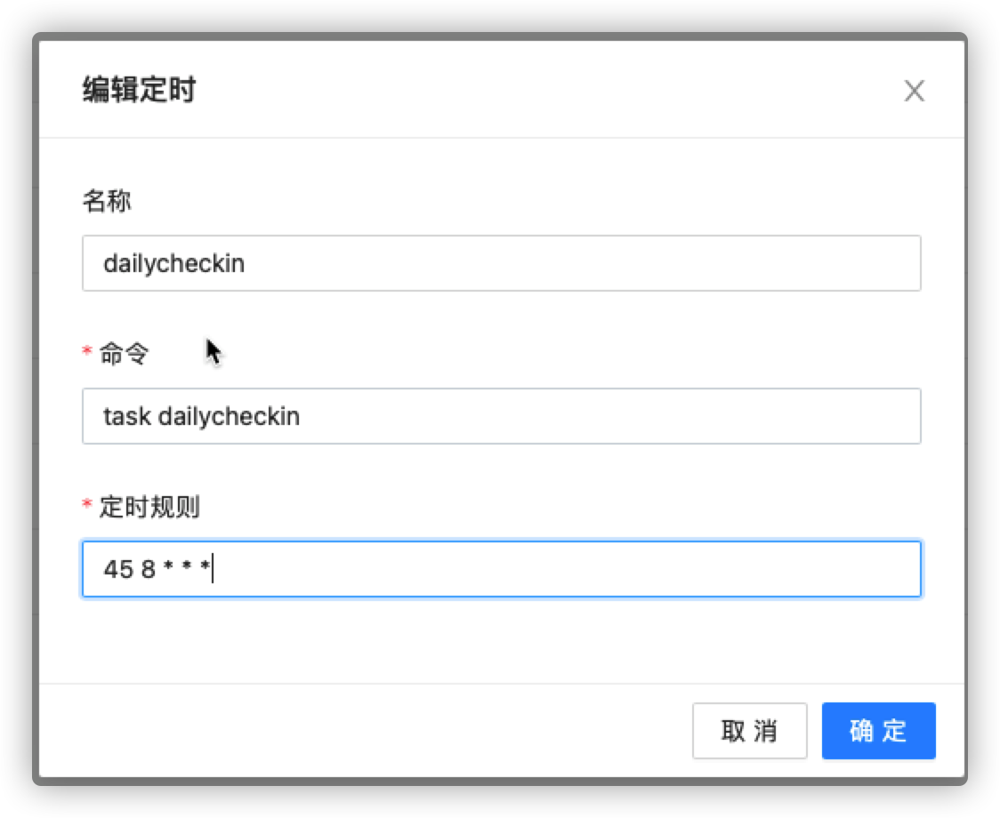
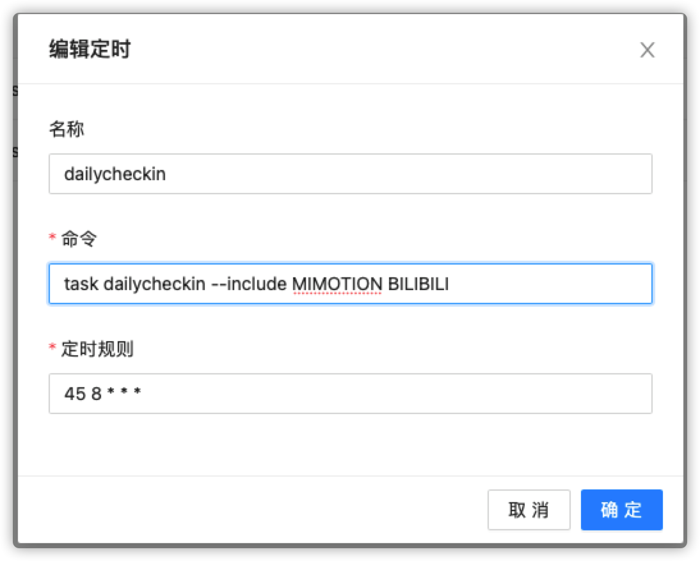
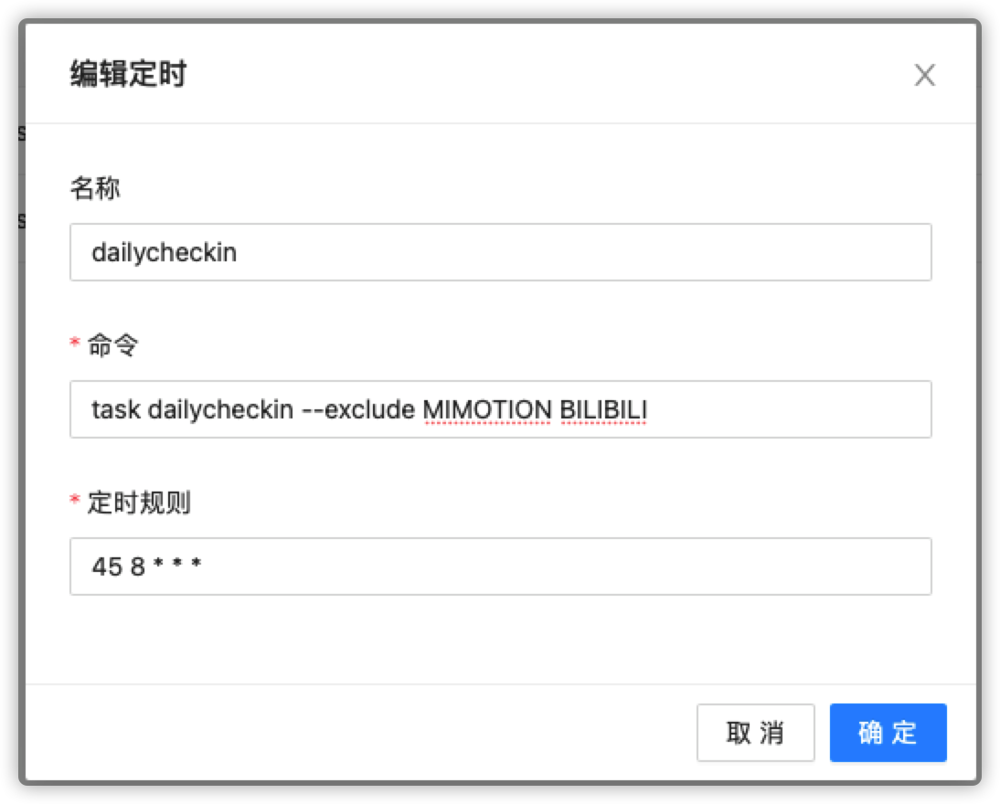
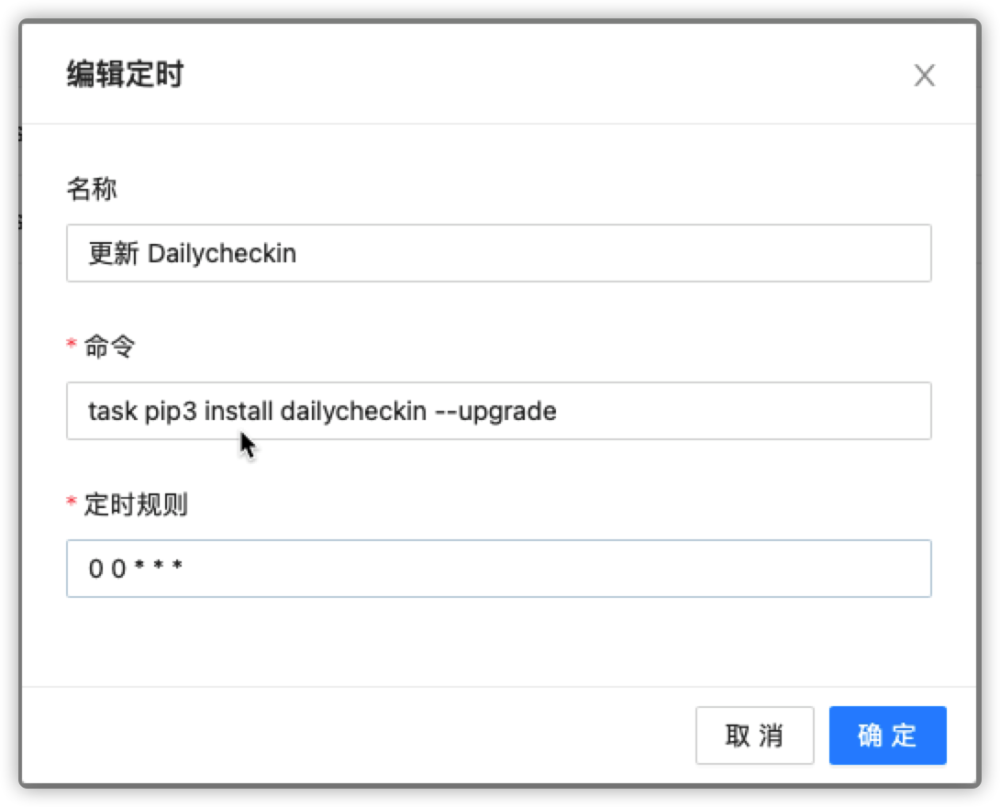

import { Cards, Card } from 'nextra/components'
import { Callout } from 'nextra/components'
import { Steps } from 'nextra/components'

<Cards>
  <Card
    title="手动部署"
    href="/install/local"
  />
  <Card
    title="Docker 部署"
    href="/install/docker"
  />
  <Card
    title="群晖部署"
    href="/install/synology"
  />
</Cards>
# 青龙使用教程

## 一、安装

<Steps>
### 选择「依赖管理」

### 新建依赖

### 「依赖类型」python3

### 「名称」输入 dailycheckin

### 点击安装

</Steps>

```bash
apk add --no-cache gcc g++ python python-dev py-pip mysql-dev linux-headers libffi-dev openssl-dev .build-deps  musl-dev  python3-dev libffi openssl
```

## 二、配置

<Callout
  type="warning"
  emoji="⚠️"
>
  请务必到 [http://www.json.cn](http://www.json.cn) 网站检查 `config.json`
  文件格式是否正确！
</Callout>

<Steps>
### 选择「脚本管理」

### 点击 ➕ 添加

### 输入文件名 config.json

### 「名称」输入 dailycheckin

### 配置 config.json 文件

参考[配置说明文档](/settings/config) ，并修改 `config.json`

</Steps>

## 三、运行

1. 运行全部脚本
   
2. 运行指定脚本（包含），可以同时选择多个，用「空格」分开
   
3. 运行指定脚本（排除），可以同时选择多个，用「空格」分开
   

## 四、更新


