import { Cards, Card } from 'nextra/components'
import { Callout } from 'nextra/components'
import { Steps } from 'nextra/components'

<Cards>
  <Card
    title="手动部署"
    href="/install/local"
  />
  <Card
    title="Docker 部署"
    href="/install/docker"
  />
  <Card
    title="青龙部署"
    href="/install/qinglong"
  />
</Cards>
# 群晖 Docker 使用教程

## 一、安装

<Steps>

### 注册表搜索「dailycheckin」，双击下载

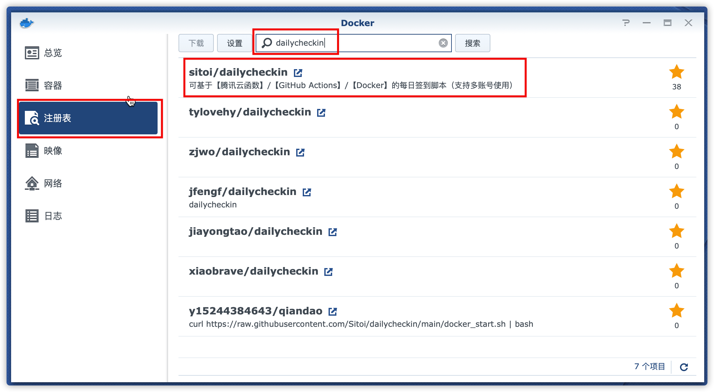

### 下载完成后，点击映像，选中「dailycheckin」，点击「启动」

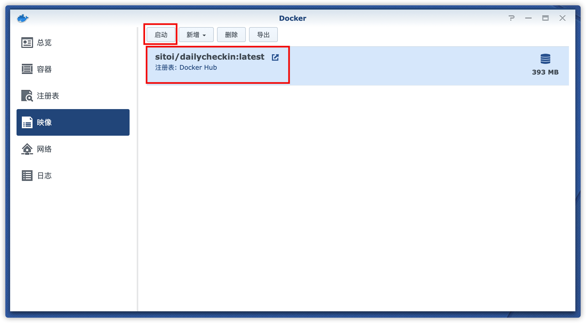

### 点击「高级设置」

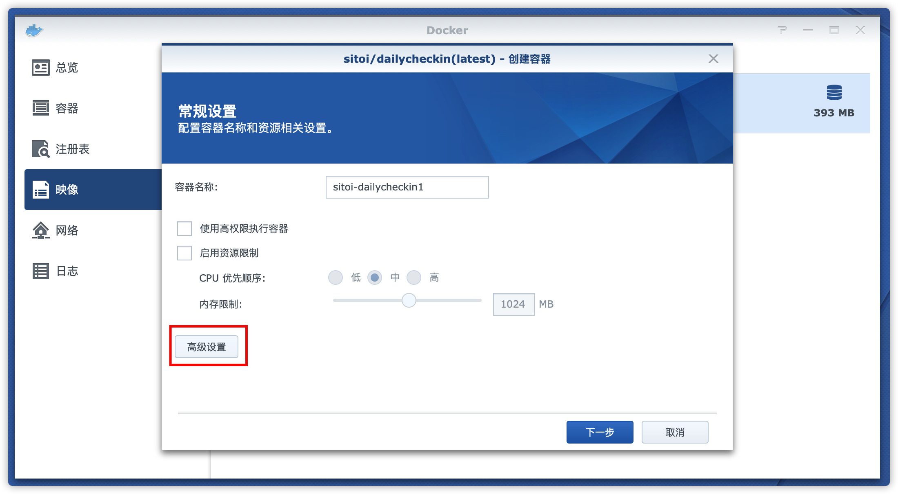

### 「存储空间」,「添加文件夹」，「新建文件夹」，按照图中的文件夹添加一致的目录结构

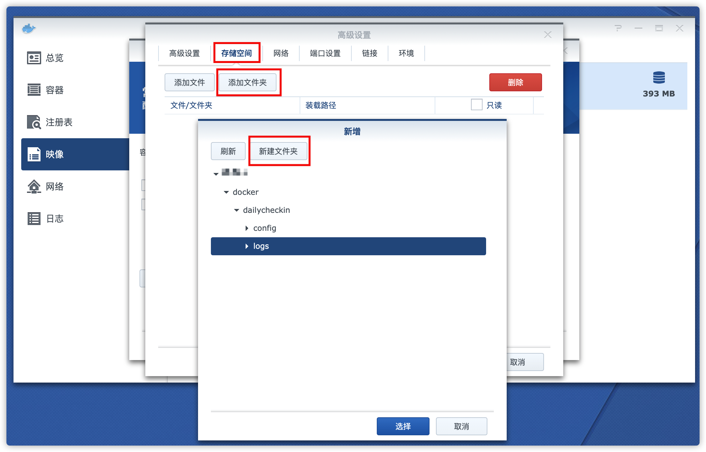

### 配置映射关系（如下图），点击「应用」

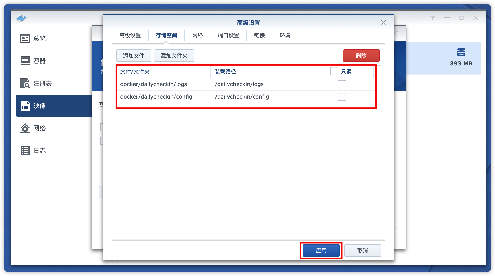

### 点击「下一步」

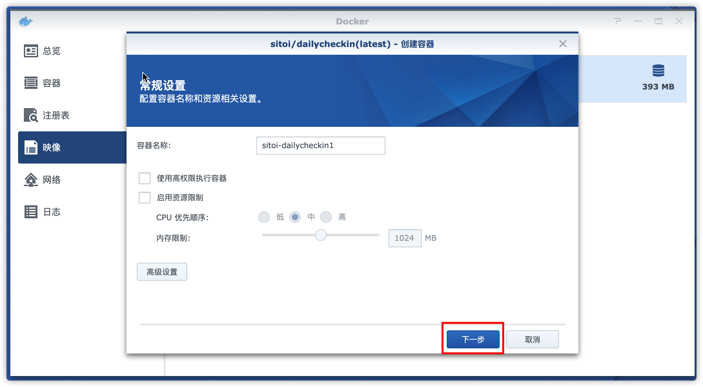

### 点击「应用」

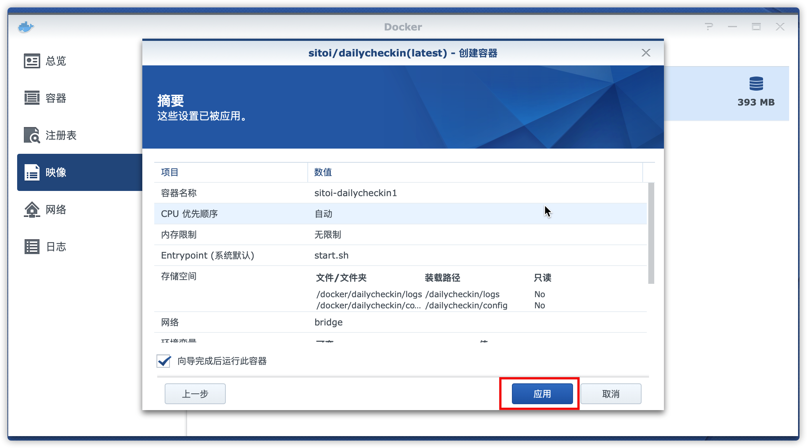

### 容器启动成功

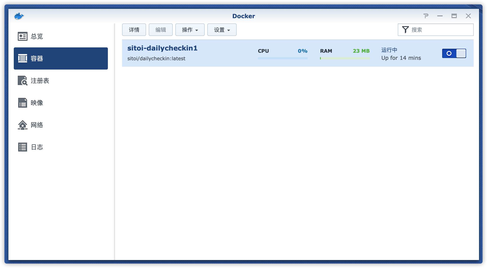

</Steps>

## 二、配置

<Callout
  type="warning"
  emoji="⚠️"
>
  请务必到 [http://www.json.cn](http://www.json.cn) 网站检查 `config.json`
  文件格式是否正确！
</Callout>

上传配置文件「config.json」到 「dailycheckin/config」目录下，参考[配置说明文档](/settings/config) ，并修改 `config.json`

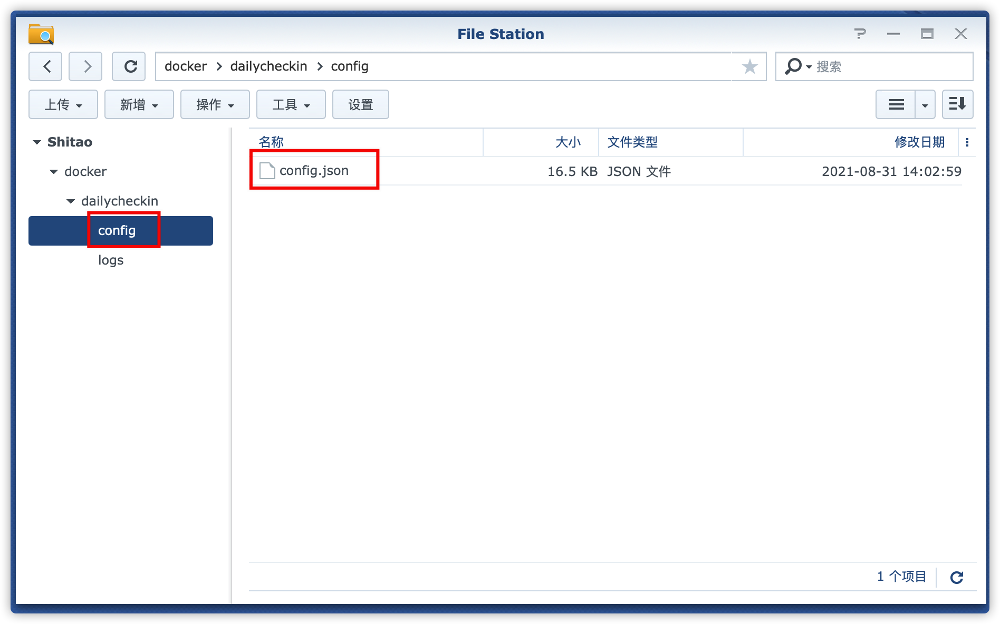

## 三、运行

<Steps>
### 点击「详情」，「终端机」，点击「新增」右侧「下拉按钮」，输入「dailycheckin」命令

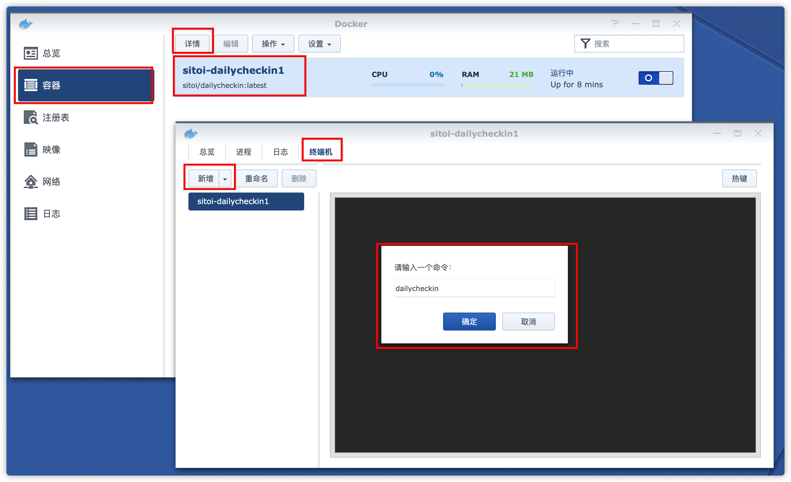

### 点击命令，输出如下内容，表示配置成功

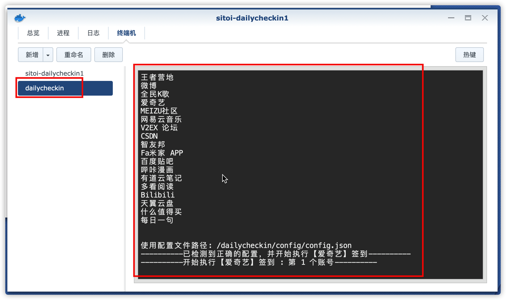

</Steps>
## 更新

自动更新
